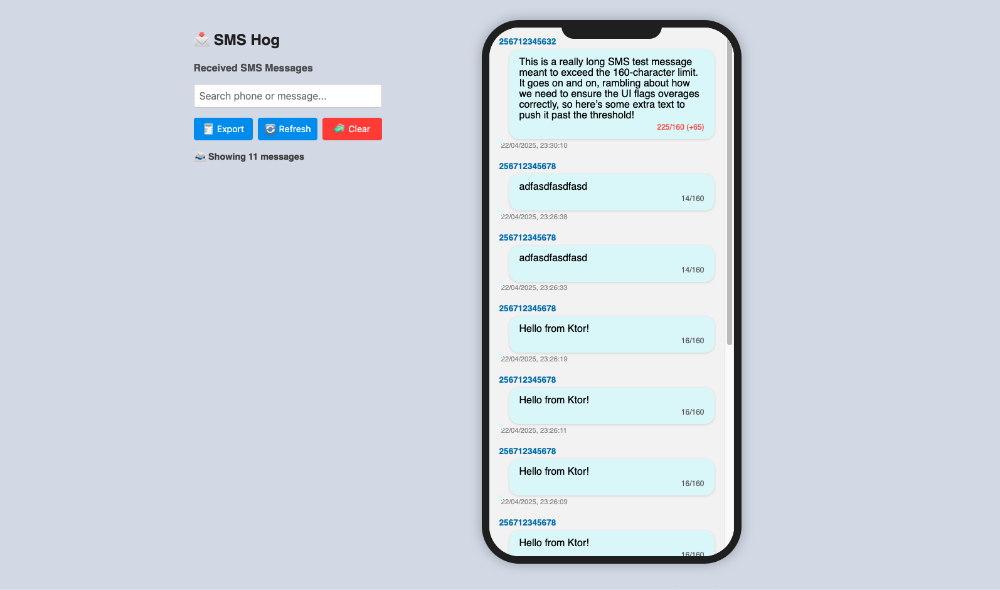

# 📩 SMS Hog

**SMS Hog** is a lightweight Node.js application designed to simulate an SMS inbox for testing purposes. It provides a web UI and REST API for receiving and viewing SMS messages. Useful for developers building SMS-related features. Easily containerized with Docker.



---

## ✅ Features

- 📬 View received SMS messages in a mobile-style inbox
- 🔁 Real-time refresh every 2 seconds
- 🧼 Clear inbox with confirmation
- 🔍 Search phone/message text
- 📥 Export to CSV
- 🐳 Docker-ready deployment

---

## 🌐 Access

By default, once running, access the app via:

[http://localhost:8188](http://localhost:8188)

---

## 📁 Project Structure

```plaintext
Dockerfile
messages.json
package.json
server.js
public/
  └── index.html
```

---

## 🛠 Prerequisites

- [Node.js](https://nodejs.org/en/) — for running locally
- [Docker](https://www.docker.com/) — for containerized setup

---

## 🚀 Getting Started

### ▶ Running Locally

1. **Install dependencies**

   ```bash
   npm install
   ```

2. **Start the server**

   ```bash
   npm start
   ```

3. **Open your browser**

   Navigate to: [http://localhost:8188](http://localhost:8188)

---

### 🐳 Running with Docker

1. **Build Docker image**

   ```bash
   docker build -t sms-hog .
   ```

2. **Run Docker container**

   ```bash
   docker run -p 8188:8188 sms-hog
   ```

3. **Open the app**

   Go to: [http://localhost:8188](http://localhost:8188)

> 💡 **Detached Mode**

```bash
docker run -d -p 8188:8188 sms-hog
```

---

## 🔧 Example API Usage

### POST a new SMS

```http
POST http://localhost:8188/api/sms
Content-Type: application/json

{
  "phone": "256712345678",
  "message": "Hello from Postman or curl. This message is long enough to test over the 160 character SMS limit. Let's see if it flags correctly in the inbox UI and splits properly."
}
```

---

## 📂 Files Overview

| File/Folder         | Description                                      |
|---------------------|--------------------------------------------------|
| `Dockerfile`        | Builds the container image                       |
| `messages.json`     | JSON file that stores incoming messages          |
| `server.js`         | Express server that exposes API + static UI      |
| `public/index.html` | The mobile-like web interface for viewing inbox  |

---

## 📄 License

MIT License © 2025
